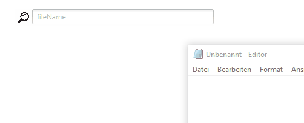

[](https://travis-ci.com/Haruki/UniveralFileFinder)
# UniveralFileFinder
A file finder that indexes and finds files for dragging to other tools/programs

- uses very small screen space
- fast startup
- automatically recognizes new and deleted files

## Installation
Files are available in the releases section.
- executable jar
- Windows native executable

Java Version 1.8.0 must be installed.

## Configuration
You have to create a configuration file named `universalfilefinder_properties.json` in your user home directory.

Example:

```json
{
  "root": [
    "c:/",
    "d:/",
    "z:/"
  ],
  "excludeRegexGlobal" : [
  	".*\\.exe$",
  	".*\\.iso$"
  ]
}
```

The `root` section is mandatory and may contain any number of directories for indexing. 
Currently only all files in the specified directory get indexed, subdirectories are ignored.
Add subdirectories separately if necessary.
The `excludeRegexGlobal` section is optional.
